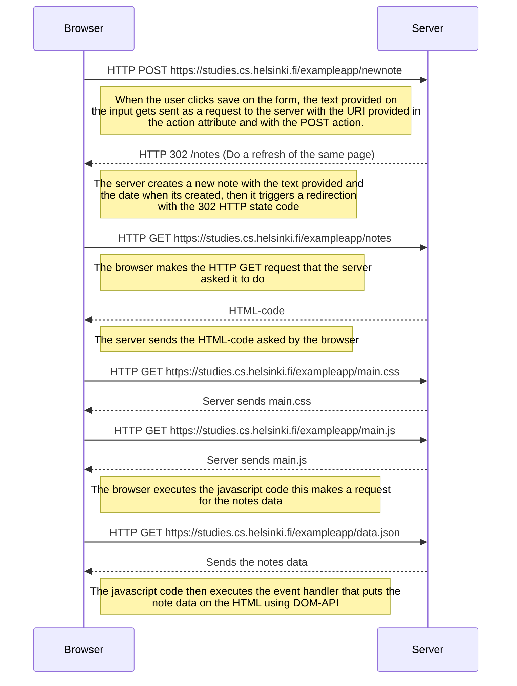

## 0.4 Exercise

```mermaid
sequenceDiagram
Browser->> Server: HTTP POST https://studies.cs.helsinki.fi/exampleapp/newnote
Note right of Browser: When the user clicks save on the form, the text provided on <br/>the input gets sent as a request to the server with the URI provided in<br/> the action attribute and with the POST action.
Server-->>Browser: HTTP 302 /notes (Do a refresh of the same page)
Note right of Browser: The server creates a new note with the text provided and <br/> the date when its created, then it triggers a redirection <br/> with the 302 HTTP state code
Browser->> Server: HTTP GET https://studies.cs.helsinki.fi/exampleapp/notes
Note right of Browser: The browser makes the HTTP GET request that the server <br/> asked it to do
Server-->>Browser: HTML-code
Note right of Browser: The server sends the HTML-code asked by the browser
Browser->>Server: HTTP GET https://studies.cs.helsinki.fi/exampleapp/main.css
Server-->>Browser: Server sends main.css
Browser->>Server: HTTP GET https://studies.cs.helsinki.fi/exampleapp/main.js
Server-->>Browser: Server sends main.js
Note right of Browser: The browser executes the javascript code this makes a request <br/> for the notes data
Browser->>Server: HTTP GET https://studies.cs.helsinki.fi/exampleapp/data.json
Server-->>Browser: Sends the notes data
Note right of Browser: The javascript code then executes the event handler that puts the <br/> note data on the  HTML using DOM-API


```
