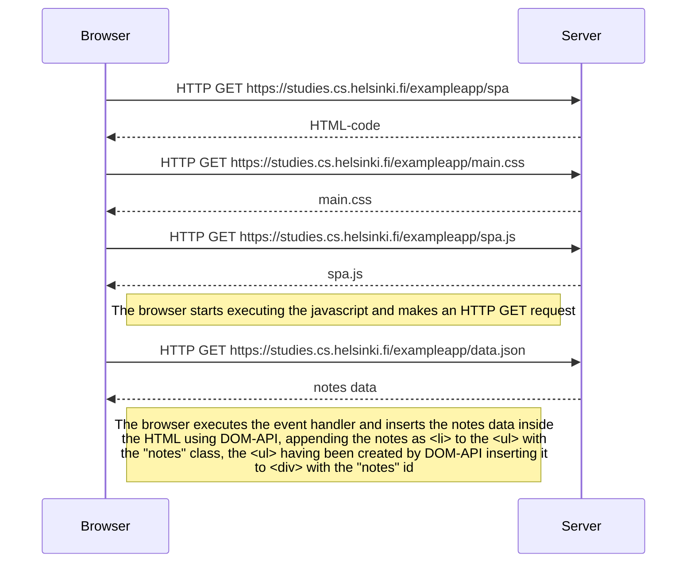

## 0.5 Exercise

```mermaid
sequenceDiagram
Browser->>Server: HTTP GET  https://studies.cs.helsinki.fi/exampleapp/spa
Server-->>Browser: HTML-code
Browser->>Server: HTTP GET https://studies.cs.helsinki.fi/exampleapp/main.css
Server-->>Browser: main.css
Browser->>Server: HTTP GET https://studies.cs.helsinki.fi/exampleapp/spa.js
Server-->>Browser: spa.js
Note right of Browser: The browser starts executing the javascript and makes an HTTP GET request
Browser->>Server: HTTP GET https://studies.cs.helsinki.fi/exampleapp/data.json
Server-->>Browser: notes data
Note right of Browser: The browser executes the event handler and inserts the notes data inside<br/> the HTML using DOM-API, appending the notes as <li> to the <ul> with <br/> the "notes" class, the <ul> having been created by DOM-API inserting it <br /> to <div> with the "notes" id
```
