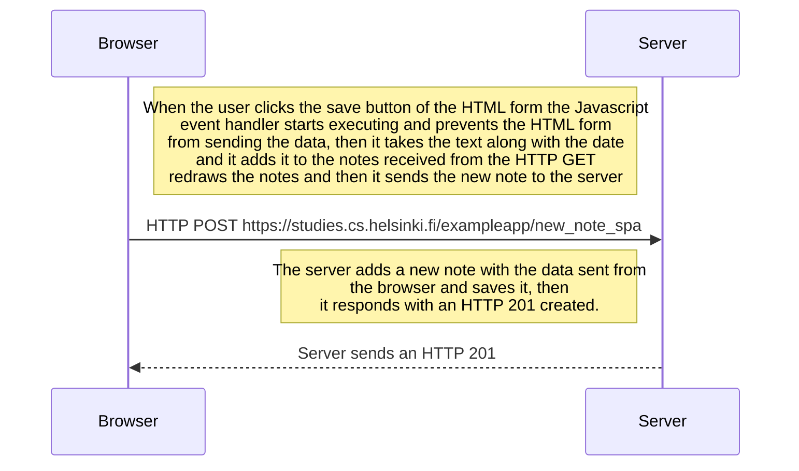

## 0.6 Exercise

```mermaid

sequenceDiagram
Note right of Browser: When the user clicks the save button of the HTML form the Javascript <br/> event handler starts executing and prevents the HTML form <br/> from sending the data, then it takes the text along with the date <br/> and it adds it to the notes received from the HTTP GET <br/> redraws the notes and then it sends the new note to the server
Browser->>Server: HTTP POST https://studies.cs.helsinki.fi/exampleapp/new_note_spa
Note left of Server: The server adds a new note with the data sent from <br/> the browser and saves it, then <br/> it responds with an HTTP 201 created.
Server-->>Browser: Server sends an HTTP 201

```
